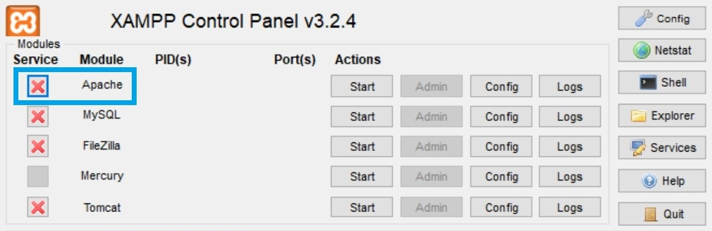
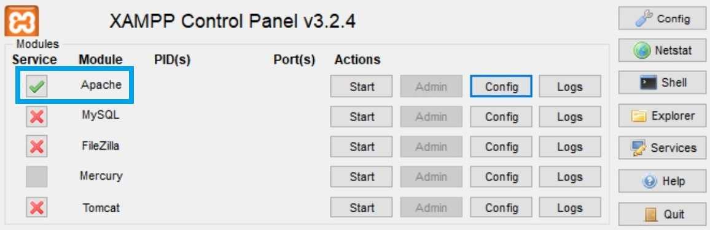
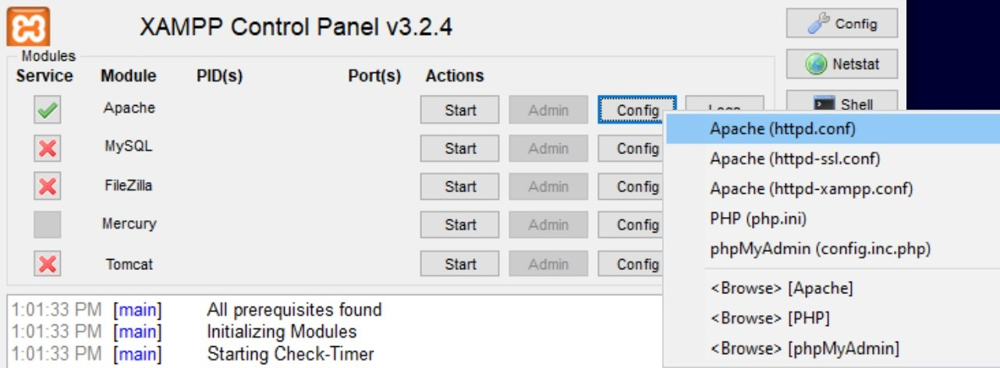
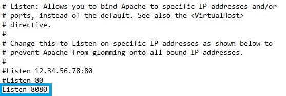
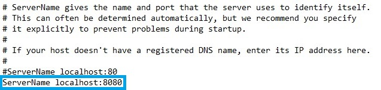
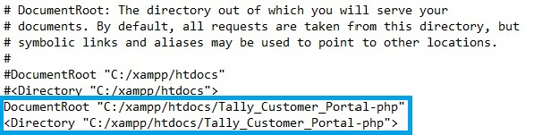
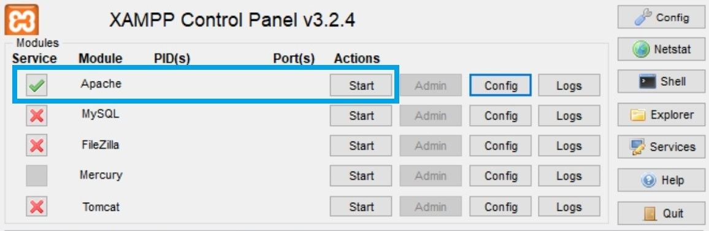
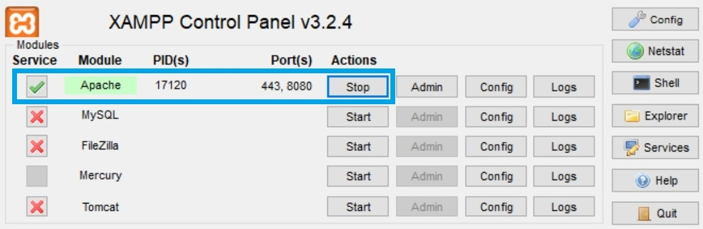

# PHP Launcher Code Examples

## Introduction
This repo is a PHP document e-signature application that supports the following authentication workflows: 

* Authentication with DocuSign via [Authorization Code Grant](https://developers.docusign.com/platform/auth/authcode).
When the token expires, the user is asked to re-authenticate. The refresh token is not used.

* Authentication with DocuSign via [JSON Web Token (JWT) Grant](https://developers.docusign.com/platform/auth/jwt/).
When the token expires, it updates automatically.

The [PHP OAuth 2.0 Client package](http://oauth2-client.thephpleague.com/) is used for authentication. This launcher includes a DocuSign OAuth2 [provider](src/Controllers/Auth/DocuSign.php) for the OAuth package and a [resource owner](src/Controllers/Auth/DocuSignResourceOwner.php) to process the results of the call to OAuth::getUser.

The OAuth library is used in the file [index.php](./public/index.php).

## eSignature API

For more information about the scopes used for obtaining authorization to use the eSignature API, see [Required scopes](https://developers.docusign.com/docs/esign-rest-api/esign101/auth#required-scopes).

For a list of code examples that use the eSignature API, select the PHP tab under [Examples and languages](https://developers.docusign.com/docs/esign-rest-api/how-to/code-launchers#examples-and-languages) on the DocuSign Developer Center.

## Installation

### Prerequisites

1. A free [DocuSign developer account](https://go.docusign.com/o/sandbox/); create one if you don't already have one.
2. A DocuSign app and integration key that is configured to use either [Authorization Code Grant](https://developers.docusign.com/platform/auth/authcode/) or [JWT Grant](https://developers.docusign.com/platform/auth/jwt/) authentication.

   
   
   If you use this launcher on your own workstation, the integration key must include redirect a URI of http://localhost:8080/public/index.php?page=ds_callback

   If you host this launcher on a remote web server, set your redirect URI as   
   
   {base_url}/index.php?page=ds_callback
   
   where {base_url} is the URL for the web app.

1. [PHP](https://www.php.net/downloads.php) 8.0.0 or later.

1. [Composer](https://getcomposer.org/download/) set up in your PATH environment variable so you can invoke it from any folder.

## XAMPP Apache web server instructions

[XAMPP Apache web server](https://www.apachefriends.org/download.html) can be configured to run the PHP launcher.

1. Extract the Quickstart ZIP file or download or clone the code-examples-php repository into your `C:/xampp/htdocs` folder.

1. In your command-line environment, switch to the folder: `cd C:xampp/htdocs/<Quickstart_folder>` or `cd C:xampp/htdocs/code-examples-php`

1. To install dependencies, run: `composer install`

1. Run XAMPP as administrator. On the XAMPP Control Panel, to the left of Apache, select the red "X" to install Apache web server. 

The red "X" becomes a green checkmark. 

5. On the XAMPP Control Panel, to the right of Apache, select the Config button > Apache (httpd.conf). The httpd.conf file should open. 

6. In the httpd.conf file, change the default `Listen 80` to `Listen 8080`. 

7. In the httpd.conf file, change the default `ServerName localhost:80` to `ServerName localhost:8080`. 

8. In the httpd.conf file, change the default 
`DocumentRoot "C:/xampp/htdocs"` 
`<Directory "C:/xampp/htdocs">` 
to 
`DocumentRoot "C:/xampp/htdocs/<Quickstart_folder>"` 
`<Directory "C:/xampp/htdocs/<Quickstart_folder>"`> 

In the httpd.conf file, use Ctrl-S to save your changes. 

9. On the XAMPP Control Panel, to the right of Apache, select the Start button. 

Apache will run. 

10. Open a browser to http://localhost:8080/public.

## Docker instructions

[Docker](https://www.docker.com/get-started) can be configured to run the PHP launcher.

1. Start Docker as administrator. 
1. Extract the [Quickstart](https://developers.docusign.com/docs/esign-rest-api/quickstart/) ZIP file or download or clone the [code-examples-php](https://github.com/docusign/code-examples-php) repository.  
1. In your command-line environment, switch to the folder: `cd <Quickstart_folder>` or `cd code-examples-php`
1. To generate the container used by the launcher, run:  `docker compose up -d`  
1. To install dependencies, run: `docker exec -it --user www-data docusign-php-fpm composer install`
1. Open a browser to http://localhost:8080/public

**Note:** To kill all containers, run: `docker rm -f $(docker ps -a -q)`

## Payments code example  

To use the payments code example, create a test payment gateway on the [Payments](https://admindemo.docusign.com/authenticate?goTo=payments) page in your developer account. See [Configure a payment gateway](./PAYMENTS_INSTALLATION.md) for details.

Once you've created a payment gateway, save the **Gateway Account ID** GUID to ds_config.php.

## License and additional information  

### License  
This repository uses the MIT License. See [LICENSE](./LICENSE) for details.

### Pull Requests
Pull requests are welcomed. Pull requests will only be considered if their content
uses the MIT License.
